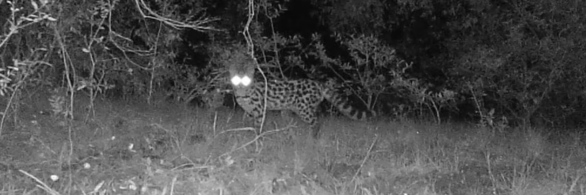

# Wildlife Tracking & Species Classification Pipeline



End-to-end system for Uruguayan camera traps: detect animals with MegaDetector, track them with ByteTrack, auto-label crops, train a species classifier, and produce per-video species counts. Built to scale from a 20-video tuning pool to larger deployments with reproducible experiments.

## Highlights
- **Three-stage vision stack**: MegaDetector (YOLOv5) → ByteTrack (Hungarian assignment) → Torch-based classifier
- **Hybrid auto-labeling**: filename regex + calibrated frame sampling yields 900+ high-quality crops across 11 species
- **Balanced training**: crop-level dataset splits (634 train / 139 val / 139 test) with class-weighted sampling
- **Reproducible outputs**: metrics, predictions, counts, and portfolio-ready visuals saved under `experiments/` & `docs/plots/`

## Latest Results
- **Model**: ResNet50 (ImageNet init), 15 epochs, AdamW, cosine LR
- **Test accuracy**: **95.7%** | **Macro F1**: **95.3%**
- **Per-class F1**: armadillo 0.84, bird 0.95, capybara 0.92, cow 1.00, dusky_legged_guan 0.94, gray_brocket 1.00, hare 0.95, human 0.97, margay 0.96, skunk 0.95, wild_boar 1.00
- Detailed metrics: `experiments/exp_003_species/metrics.json` | Predictions: `experiments/exp_003_species/predictions_test.csv`

## Visual Gallery (docs/plots)
- `confusion_matrix.png` – Test split confusion heatmap
- `species_counts.png` – Aggregated track counts per species
- `crop_grid.png` – Sample of labelled crops across species

## Before You Start
- Download MegaDetector weights to `models/detectors/md_v5a.0.0.pt` (matches `config/pipeline.yaml`).
- First detection run will pull YOLOv5 from `torch.hub`; ensure internet access the first time.
- Videos for the main dataset live in `data/dataset-v1/` (aligned with `paths.videos_raw`).

## Pipeline Overview
```
Videos → scripts/10_run_md_batch.py → scripts/20_run_tracking.py →
        scripts/31_autolabel_from_filenames.py → training/train_classifier.py →
        training/eval_classifier.py → scripts/40_counts_by_species.py
```

1. **Detection** – MegaDetector (YOLOv5) with tuned thresholds exports `data/md_json/`
2. **Tracking** – ByteTrack runner (`scripts/20_run_tracking.py`) produces `data/tracking_json/`
3. **Auto-labeling** – Hybrid frame sampler + regex species map saves crops to `data/crops/` and manifest `data/crops_manifest.csv`
4. **Dataset QA** – `experiments/exp_003_autolabel/summary.py` + validation notes, balanced crop-level splits (`splits.json/csv`)
5. **Training** – `training/train_classifier.py` builds Torch datasets/dataloaders, logs metrics/checkpoints to `experiments/exp_003_species/`
6. **Evaluation** – `training/eval_classifier.py --split test` exports metrics + per-crop predictions
7. **Counts** – `scripts/40_counts_by_species.py` aggregates predicted species per video (`experiments/exp_004_counts/`)

## Quick Start
```bash
# 0. Environment (conda recommended)
conda env create -f environment.yml
conda activate megadetector-pipeline

# 1. Detection (reads data/dataset-v1)
python scripts/10_run_md_batch.py --config config/pipeline.yaml --video-dir data/dataset-v1

# 2. Tracking
python scripts/20_run_tracking.py --config config/pipeline.yaml --md-json data/md_json --video-root data/dataset-v1

# 3. Auto-label crops
python scripts/31_autolabel_from_filenames.py --config config/pipeline.yaml --tracks-json data/tracking_json --video-root data/dataset-v1 --out-dir data/crops --manifest data/crops_manifest.csv

# 4. Prepare splits (crop-level balanced)
python training/prepare_split.py --config config/pipeline.yaml --manifest data/crops_manifest.csv --out-dir experiments/exp_003_autolabel --strategy crop

# 5. Train classifier (GPU recommended)
python training/train_classifier.py --config config/pipeline.yaml --manifest data/crops_manifest.csv --splits experiments/exp_003_autolabel/splits.json --output-dir experiments/exp_003_species --model resnet50

# 6. Evaluate best checkpoint
python training/eval_classifier.py --config config/pipeline.yaml --manifest data/crops_manifest.csv --splits experiments/exp_003_autolabel/splits.json --checkpoint experiments/exp_003_species/best_model.pt --output-dir experiments/exp_003_species --split test

# 7. Aggregate counts per video
python scripts/40_counts_by_species.py --manifest data/crops_manifest.csv --predictions experiments/exp_003_species/predictions_test.csv --out-dir experiments/exp_004_counts
```

### End-to-End Inference on New Footage
```bash
python scripts/run_inference_pipeline.py \
  --videos data/video_inference \
  --checkpoint experiments/exp_003_species/best_model.pt \
  --output experiments/exp_005_inference
```

This command runs detection → tracking → crop extraction → classifier inference → species counts, and renders labeled MP4s under `experiments/exp_005_inference/videos_labeled/`.

## Configuration Tips
- **Species regex mapping** (`config/species_map.yaml`): adjust filename patterns to support new species or naming conventions.
- **Sampling & auto-labeling knobs** (`config/pipeline.yaml`): tune `sampling`, `autolabel`, and `classification.species_crop_targets` to balance crops per class.
- **Skip classes**: inference pipeline temporarily clears `classification.skip_classes` so every track receives a prediction; edit the config if you want to keep `no_animal` / `unknown_animal` filtered out.

## Visualization & QA Tools
- `scripts/21_viz_tracks.py` – overlay track IDs, detection confidence, and continuity for manual review.
- `scripts/render_labeled_video.py` – produces MP4s with predicted species labels for stakeholder handoff.
- `scripts/generate_portfolio_plots.py` – regenerates confusion matrices, crop grids, and species count plots in `docs/plots/`.
- `experiments/exp_003_autolabel/summary.py` – creates manifest summaries plus QC checklists.

## Testing
Run regression tests to verify splits, aggregation, and config helpers:
```bash
python -m unittest discover tests
```

## Repository Map
```
wildlife-tracking-uruguay/
├── config/                    # YAML configs (pipeline thresholds, training hyperparams)
├── scripts/                   # Stage-wise pipeline scripts + plotting utilities
│   ├── 10_run_md_batch.py
│   ├── 20_run_tracking.py
│   ├── 31_autolabel_from_filenames.py
│   ├── 40_counts_by_species.py
│   ├── 21_viz_tracks.py
│   └── generate_portfolio_plots.py
├── training/                  # PyTorch training/eval utilities
│   ├── data_utils.py
│   ├── train_classifier.py
│   └── eval_classifier.py
├── experiments/               # Logged artefacts (calibration, splits, metrics, counts)
├── docs/plots/                # Portfolio visuals (PNG)
├── guides/                    # Detailed implementation journals
└── tests/                     # Lightweight regression tests for configs/splits/counts
```

## Datasets & Experiments
- **Video inventory:** `experiments/exp_003_autolabel/video_inventory.md` (89 labelled clips across 11 species)
- **Autolabel QA:** `summary.csv`, `report.md`, `validation_notes.md`
- **Training metrics:** `experiments/exp_003_species/metrics.{csv,json}`, `best_model.pt` (tracked with Git LFS)
- **Counts analytics:** `experiments/exp_004_counts/results.csv`

## References
- [MegaDetector](https://github.com/microsoft/CameraTraps)
- [ByteTrack](https://github.com/ifzhang/ByteTrack)
- [Torchvision](https://pytorch.org/vision/stable/index.html)
